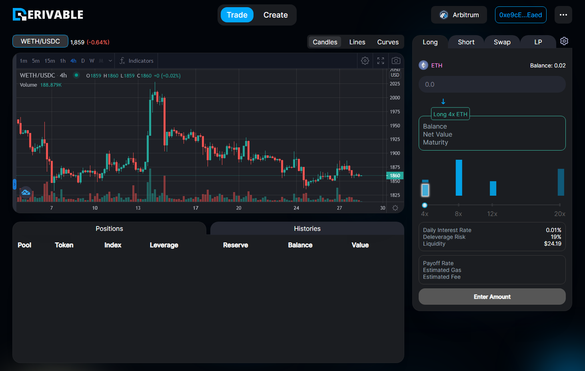

# Trade


Derion Interface



The screenshots on this page were taken on the previous version of the interface and have not yet been retaken for the current release.


To start trading on Derion, go to [app.derion.io](https://app.derion.io) and connect your wallet. The interface should look like this:

<figure><figcaption>
Trade
</figcaption></figure>

On the right side, you will have 4 operational tabs: Long, Short, Swap, and LP.

* Long: open long positions.
* Short: open short positions.
* Swap: swap and convert between tokens and positions (advanced).
* LP: provide liquidity, either to a single pool's [LP class](../../liquidity/lp-class.md) or through the [Vault](../../liquidity/vault.md).
