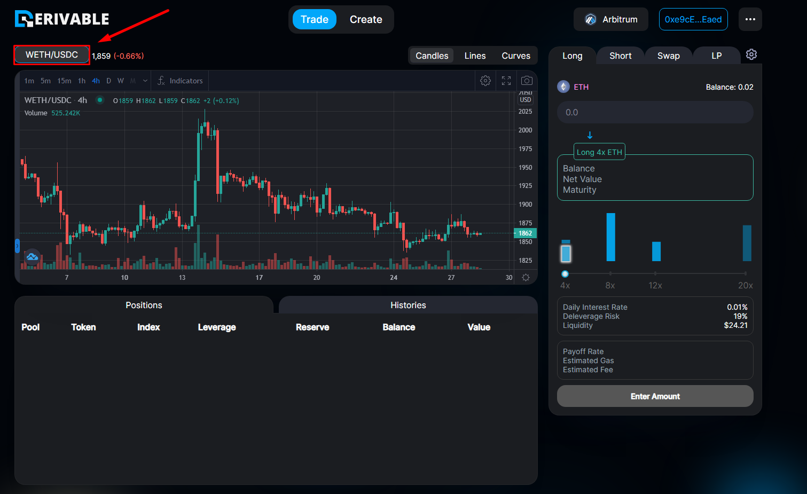
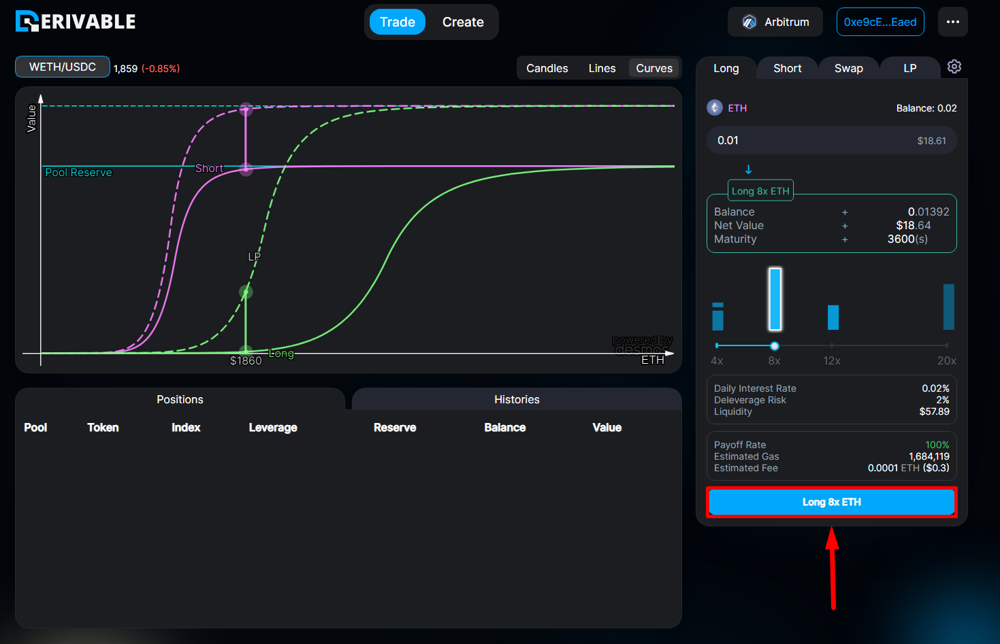
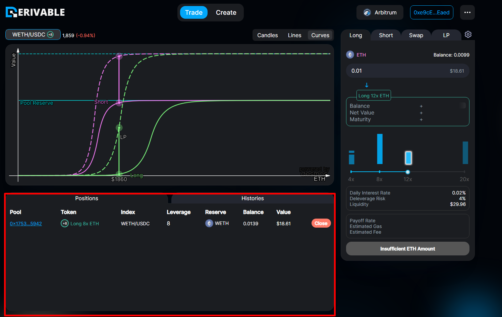

# Long/Short


The screenshots on this page were taken on the previous version of the interface and have not yet been retaken for the current release.


To open a long/short position on Derion, first, choose the asset pair you wish to trade. The trading pair can be selected at the top left of the screen.

<figure><figcaption>
Long/Short
</figcaption></figure>

Afterward, you can choose to either long or short on the right panel, and select between the available leverage levels. After choosing the leverage and entering the amount you want to trade, you should consider a number of factors before opening the position:

* Net Value: the value of your position without applying leverage (net).
* Size: the total value of your position after applying leverage.
* Daily Interest Rate: the [funding](../../protocol/funding-rate.md) you pay daily to maintain your position.
* Premium Rate: the extra funding you pay while your side of the market is the crowded one.
* Deleverage Risk: the risk of your position entering the deleveraged regime. The larger the position relative to the pool, the higher the risk.
* Estimated Gas/Estimated Fee: the estimated gas fee at that time.

After carefully checking all the details, open the position with the blue button under the panel. Its label names the side, leverage, and asset you selected.

<figure><figcaption>
Open Position
</figcaption></figure>

After confirming the transaction in your wallet, your position should be shown on the bottom-left panel. You can close your position anytime here.

<figure><figcaption>
Positions
</figcaption></figure>
