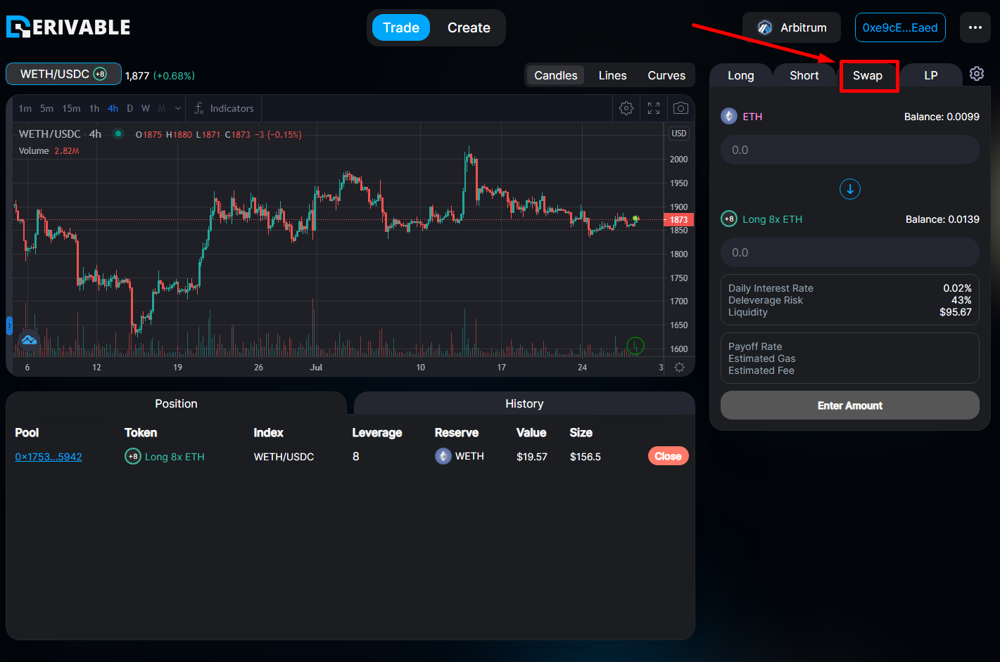
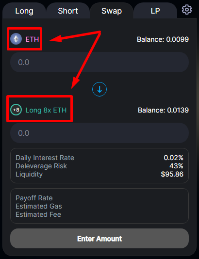
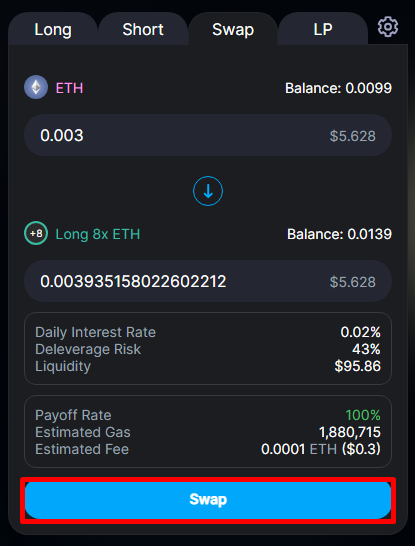

# Swap


The screenshots on this page were taken on the previous version of the interface and have not yet been retaken for the current release.


“Swap” is our feature to trade between different tokens, including long/short position tokens, alongside other cryptocurrencies (ETH, WETH). Under the hood, a swap is a single multi-direction [transition](../../protocol/state-transition.md) — for example, flipping a Long into a Short without closing to the reserve token first.

Change to the “Swap” tab on the right panel to use swap.

<figure><figcaption></figcaption></figure>

Here you select the trading pair you want to swap by clicking on their icons on the right panel.

<figure><figcaption></figcaption></figure>

Enter the amount of tokens you want to swap, then click “Swap”. Proceed with confirming the transaction in your wallet.

<figure><figcaption></figcaption></figure>
