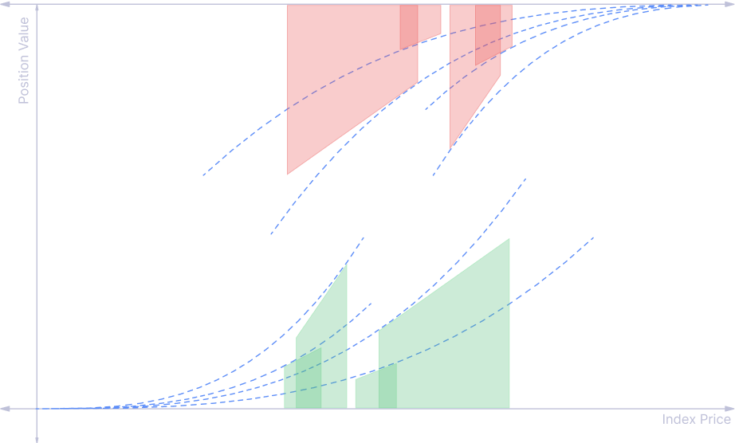

# Launchpad

The first partnership we are seeking is with Launchpads to integrate with [ifo.md](../apps/ifo.md "mention"). Our launchpad partners will directly receive a majority of our protocol fee. Anyone who contributes to a successful partnership will receive a Referrer Share from the protocol fee, after deducting the partner's share.

<figure><figcaption></figcaption></figure>

Referrer share calculation from pool fee, after deducting the partner's share (for reference only):

* referrer receives \~$4k for the first $5k pool revenue
* referrer receives \~$7k for the first $10k pool revenue
* referrer receives \~$9k for the first $15k pool revenue

Formula: $$10k \times ln({revenue \over 10k} + 1)$$

