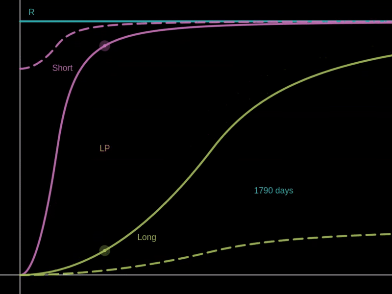

# Funding Rate

There are two components to the Funding Rate: the Interest Rate and the Premium Rate.

The Interest Rate is continuously charged from both the Long and Short sides to the LP side. This rate is configured by each pool as a fixed daily percentage, with 1/5 of it being collected as the protocol fee.

<figure><figcaption>
Interest and Protocol Fee
</figcaption></figure>

The Premium Rate is charged to the larger side of Long and Short and is paid to the other two sides proportionally, offering them the chance of negative funding rates as an incentive to balance the market.

* If the pool has equal reserves for Long and Short, no premium is charged whatsoever.
* If the pool has approximately 100% reserve for Long and 0% for Short and LP, Long positions will have to pay the Maximum Premium Rate, and this premium will be split between Short and LP positions pro-rata.
* If the pool has a 45% reserve for Short, 25% for Long, and 30% for LP, Short positions will have to pay (45% - 25%) \* 45% = 8% of the Maximum Premium Rate, and this premium will be split between Long and LP positions pro-rata.

Unlike conventional perpetuals exchanges where the funding rate is manually charged and updated periodically, Derivable's funding rate is autonomous and continuously applied every block of the underlying platform.

