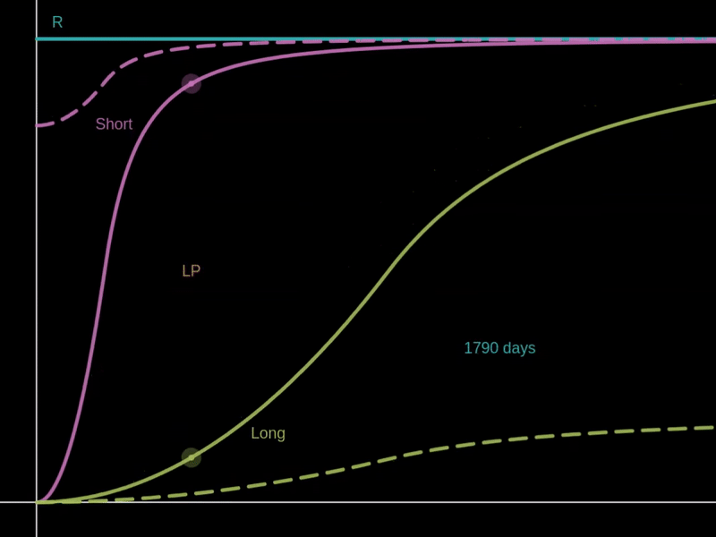

# Interest and Fee

## Funding Rate

There are two components to the Funding Rate: the LP Interest and the Protocol Fee.

The LP Interest Rate is a constant charge from both the Long and Short sides to the LP side. This rate is configured by each pool as a fixed daily percentage and also decreases as the curve is deleveraged. This means that the LP interest rate is proportional to the effective leverage of each side in the pool.

<figure><figcaption><p>LP Interest and Protocol Fee</p></figcaption></figure>

The Protocol Fee is constantly charged from both the Long and Short sides, and this rate is fixed as 1/5 of the pool's LP Interest Rate. Unlike LP Interest, this fee rate is not affected by the deleveraging of the curves.

For example, consider a pool initialized with a daily LP Interest Rate of 0.06%:

* The LP will receive interest payments equivalent to 0.06% of both the LONG and SHORT reserves every day.
* Derivable Labs will receive fee payments equivalent to 0.012% of both the LONG and SHORT reserves every day.

## Interest Rate Guide

### Comparison with Centralized Perps

Derion pools charge a single **interest rate** on both long and short positions, paid to LPs. This replaces three separate costs in centralized perps:

| Cost Component | CEX Perp | Derion |
|---|---|---|
| Interest | 0.03%/day on notional (fixed) | Configurable via `INTEREST_HL` |
| Funding/Premium | Variable, ~0.03-0.15%/day on notional | Not used (set to 0) |
| Liquidation risk | Implicit, ~0.05-0.3%/day equivalent | None (no liquidation) |
| **Typical total** | **~0.1-0.5%/day on notional** | **Single interest rate** |

### How Interest Works

Interest decays the pool coefficients `a` and `b` with half-life `INTEREST_HL`. Both long (`rA`) and short (`rB`) reserves decay, transferring value to LP (`rC`).

* Decay formula: `rate = 2^(-elapsed / INTEREST_HL)`
* The rate is on **reserve value**, not notional

### Notional vs Reserve Conversion

The UI input is in **notional terms** (like CEX perps). The conversion to contract parameter:

```
INTEREST_HL = (SECONDS_PER_DAY × ln2) / (input_rate × K / 100)
```

Where:

* `input_rate` = user-entered %/day (on notional)
* `K` = leverage power parameter
* `SECONDS_PER_DAY` = 86400
* `ln2` ≈ 0.693

The `× K` factor converts from notional rate to reserve rate, because:

* Notional exposure ≈ K × reserve value
* To charge `r%` on notional → charge `r × K%` on reserve

### Why No Liquidation Changes the Equation

In CEX perps at 10x leverage, a 10% adverse move liquidates the position (total loss of margin). In Derion:

* **Upside**: Linear with dynamic R (same as CEX perps)
* **Downside**: Compounding decay (`price^K`), positions shrink but never reach zero
* Traders are willing to pay a premium for this protection
* LPs bear more downside risk (no liquidation to protect them)

The interest rate must compensate LPs for this additional risk.

### Suggested Rates by Oracle Pool Fee Tier

The UniswapV3 fee tier is a market-derived proxy for volatility — LPs self-select higher fee tiers for more volatile pairs.

| Fee Tier | Pool Type | Examples | Suggested Rate | Rationale |
|---|---|---|---|---|
| 0.01% (100) | Stable pairs | USDC/USDT | 0.05%/day | Minimal volatility, low liquidation risk |
| 0.05% (500) | Major pairs | ETH/USDC, BTC/USDC | 0.1%/day | Moderate volatility, covers CEX interest + avg funding |
| 0.3% (3000) | Mid-tier pairs | LINK/ETH, UNI/ETH | 0.2%/day | Higher volatility, significant liquidation risk equivalent |
| 1% (10000) | Volatile/exotic | Memecoins, low-cap | 0.3%/day | High volatility, high liquidation risk equivalent |

### CEX Perp Equivalence at Different Leverage

Since Derion's interest is on notional (after the K conversion), the cost comparison with CEX perps at the same leverage:

| Derion Rate | CEX Interest | CEX Avg Funding | Liquidation Risk | Total CEX Equivalent |
|---|---|---|---|---|
| 0.05%/day | 0.03%/day | ~0%/day | ~0%/day | Stable pairs |
| 0.1%/day | 0.03%/day | ~0.03%/day | ~0.04%/day | Major pairs |
| 0.2%/day | 0.03%/day | ~0.07%/day | ~0.1%/day | Mid-tier pairs |
| 0.3%/day | 0.03%/day | ~0.1%/day | ~0.17%/day | Volatile pairs |

### Key Takeaways

1. **0.1%/day** is a good default for major pairs (ETH, BTC) — matches CEX perp total cost
2. **Higher rates** for volatile pairs compensate LPs for the no-liquidation risk
3. **Lower rates** for stable pairs where liquidation risk is negligible
4. The fee tier of the oracle pool is the best on-chain signal for appropriate rate selection
