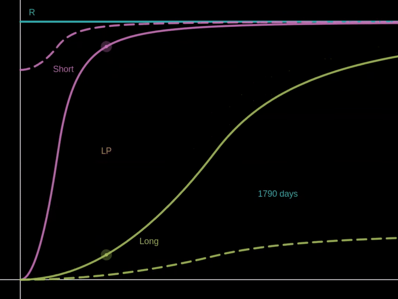

# Interest and Fee

There are two components to the Funding Rate: the LP Interest and the Protocol Fee.

The LP Interest Rate is a constant charge from both the Long and Short sides to the LP side. This rate is configured by each pool as a fixed daily percentage and also decreases as the curve is deleveraged. This means that the LP interest rate is proportional to the effective leverage of each side in the pool.

<figure><figcaption>
LP Interest and Protocol Fee
</figcaption></figure>

The Protocol Fee is constantly charged from both the Long and Short sides, and this rate is fixed as 1/5 of the pool's LP Interest Rate. Unlike LP Interest, this fee rate is not affected by the deleveraging of the curves.

For example, consider a pool initialized with a daily LP Interest Rate of 0.06%:

* The LP will receive interest payments equivalent to 0.06% of both the LONG and SHORT reserves every day.
* Derivable Labs will receive fee payments equivalent to 0.012% of both the LONG and SHORT reserves every day.
