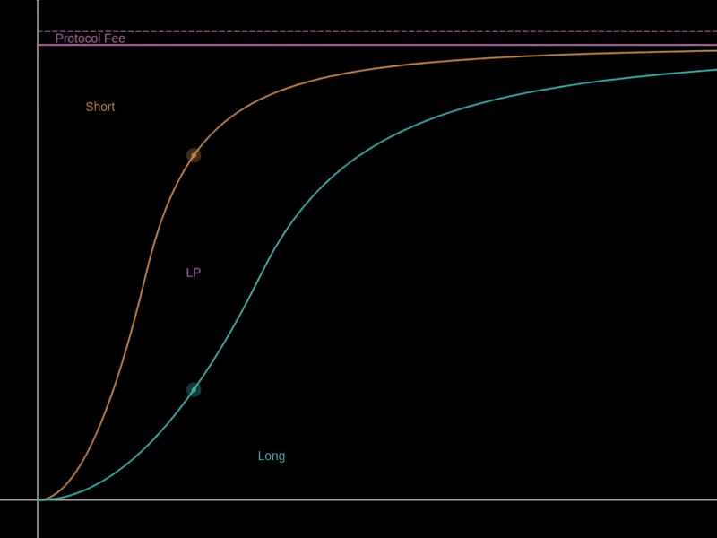

# Funding Rate

There are two components to the Funding Rate: the LP Interest Rate and the Protocol Fee Rate.

The LP Interest Rate is constantly charged from both the Long and Short sides to the LP side. This rate is configured by each pool as a fixed daily percentage and also decreases as the curve is deleveraged. That means the LP interest rate is proportional to the effective leverage of its side in a pool.

<figure><figcaption>
LP Interest and Protocol Fee
</figcaption></figure>

The Protocol Fee Rate is constantly charged from all sides of the pool, and this rate is fixed as 1/8 of the pool's configured LP Interest Rate.

For example, a pool initialized with an LP Interest Rate of 0.04% daily:

* Every day, 0.04% of the LONG reserve and 0.04% of the SHORT reserve will be paid to the LP reserve as the interest rate.
* Every day, 0.005% of the total pool reserve will be paid to the Derivable Labs as the protocol fee.
